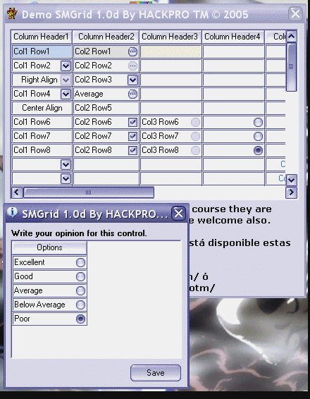

## SMGrid 1\.0d

### Description

EMULATE a FlexGrid Control.

This control was necessary to develop it for a program of a thesis of grade of my University, their evolution was stopped by a lot of time, although this isn't completely ended, but it's a beginning.

Thanks to all those that supported my work in this site.
 
### More Info
 

             |
---                |---
**Submitted On**   |2005-07-09 13:48:10
**By**             |[Heriberto Mantilla Santamaria](https://github.com/Planet-Source-Code/PSCIndex/blob/master/ByAuthor/heriberto-mantilla-santamaria.md)
**Level**          |Intermediate
**User Rating**    |5.0 (50 globes from 10 users)
**Compatibility**  |VB 5\.0, VB 6\.0
**Category**       |[Custom Controls/ Forms/  Menus](https://github.com/Planet-Source-Code/PSCIndex/blob/master/ByCategory/custom-controls-forms-menus__1-4.md)
**World**          |[Visual Basic](https://github.com/Planet-Source-Code/PSCIndex/blob/master/ByWorld/visual-basic.md)
**Archive File**   |[SMGrid\_1\_0191139792005\.zip](https://github.com/Planet-Source-Code/heriberto-mantilla-santamaria-smgrid-1-0d__1-61541/archive/master.zip)

